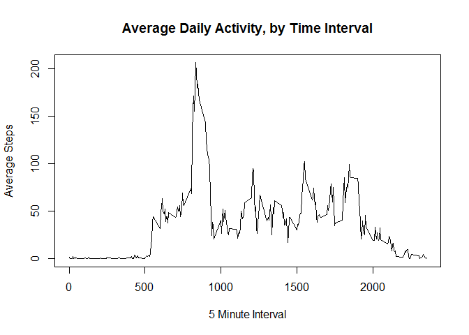
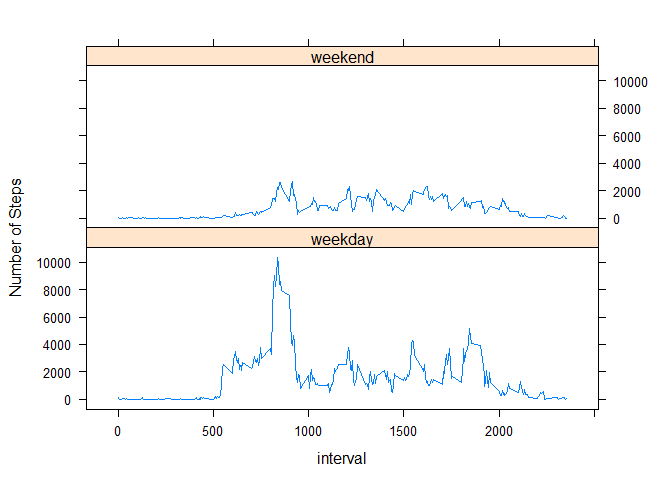

# Reproducible Research - Peer Assessment 1
Peter Cebo  
Sunday, December 14, 2014  

##Loading and preprocessing the data

First, we load the data, assuming that it is in our working directory.


```r
full_data <- read.csv('activity.csv', colClasses=c("numeric", "Date", "numeric"))
```

We are told we can ignore NA values for now. For efficiency, let's pre-process (clean) the data by removing any NA values.


```r
data <- subset(full_data, !is.na(full_data$steps))
```

##What is mean total number of steps taken per day?

Next, we answer the first question of how many steps were taken each day. Note that we use plyr which may need to be installed first. We also decide to use ggplot2.


```r
library(plyr)
```

```
## Warning: package 'plyr' was built under R version 3.1.1
```

```r
library(ggplot2)
```

```
## Warning: package 'ggplot2' was built under R version 3.1.1
```

```r
day_steps <- ddply(data, .(date), summarise, steps=sum(steps))
qplot(steps, data=day_steps)
```

```
## stat_bin: binwidth defaulted to range/30. Use 'binwidth = x' to adjust this.
```

 

We also calculate the mean and median number of steps taken per day.


```r
mean(day_steps$steps)
```

```
## [1] 10766.19
```

```r
median(day_steps$steps)
```

```
## [1] 10765
```

##What is the average daily activity pattern?

As requested, we make a time series plot (i.e. type = "l") of the 5-minute interval (x-axis) and the average number of steps taken, averaged across all days (y-axis). We use the base plotting package here.


```r
interval_avg <- ddply(data, .(interval), summarise, steps=mean(steps))
plot(interval_avg$interval, interval_avg$steps, type="l", xlab="5 Minute Interval", 
ylab="Average Steps",main="Average Daily Activity, by Time Interval")
```

 

Which 5-minute interval, on average across all the days in the dataset, contains the maximum number of steps? We can see from the chart that it is somewhere in the morning (~9AM?) but we use the following code to get an exact answer, which is 835:


```r
interval_avg[(interval_avg$steps==max(interval_avg$steps)),]
```

```
##     interval    steps
## 104      835 206.1698
```


##Imputing missing values

Calculate and report the total number of missing values in the dataset (i.e. the total number of rows with NAs)


```r
sum(is.na(full_data$steps))
```

```
## [1] 2304
```

We decide to use the mean for that 5-minute interval to fill the NAs. The following code creates the new dataset based on that decision.


```r
imputed <- full_data
imputed$steps[is.na(imputed$steps)] <- interval_avg[match(imputed$interval, interval_avg$interval),"steps"]
```

```
## Warning in imputed$steps[is.na(imputed$steps)] <-
## interval_avg[match(imputed$interval, : number of items to replace is not a
## multiple of replacement length
```

Finally, we make a histogram of the total number of steps taken each day and calculate and report the mean and median total number of steps taken per day. 


```r
day_steps_imp <- ddply(imputed, .(date), summarise, steps=sum(steps))
qplot(steps, data=day_steps_imp)
```

```
## stat_bin: binwidth defaulted to range/30. Use 'binwidth = x' to adjust this.
```

 

```r
mean(day_steps_imp$steps)
```

```
## [1] 10766.19
```

```r
median(day_steps_imp$steps)
```

```
## [1] 10766.19
```


As we can see, the differences between this and the first part of the assignment are very minor. The median has changed slightly and the mean has stayed the same.

##Are there differences in activity patterns between weekdays and weekends?

We add a new column to our df to indicate whether the day is a weekday or a weekend. We do so by using an if statement and the weekdays function:


```r
imputed$day<- as.factor(ifelse(weekdays(imputed[,2])=="Saturday" | weekdays(imputed[,2])=="Sunday", "weekend", "weekday"))
```

We summarize the data and chart as directed to compare weekdays vs. weekend days:


```r
library(lattice)
day_steps_imp_wd <- ddply(imputed, .(day,interval), summarise, steps=sum(steps))
xyplot(steps ~ interval | day, data = day_steps_imp_wd, type='l', layout = c(1,2), ylab="Number of Steps")
```

 

Clearly, we can see there's a distinct difference between a weekday and weekend day. Subjects are clearly more active on weekdays (on average) during certain periods which makes sense thinking logically - lots of people are running around to get to work, get kids off to school etc at the same time every weekday.

This completes the assignment. Thanks for following along!
